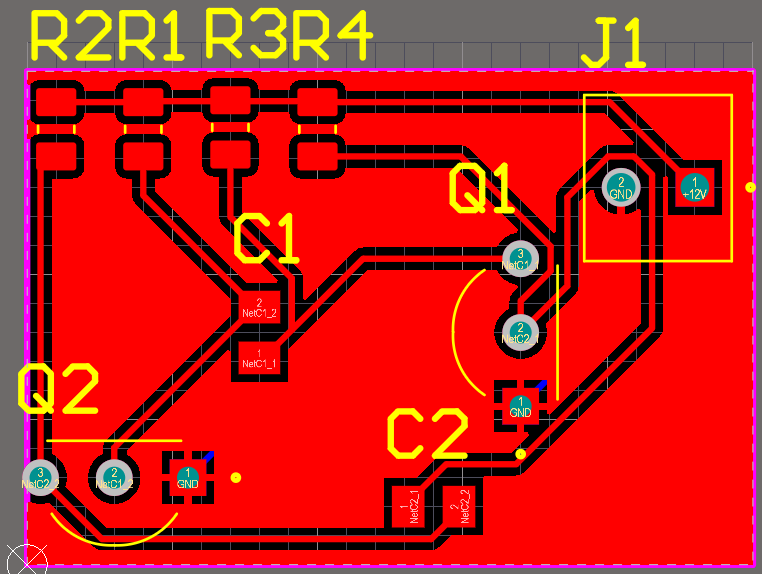

# Проєкт: Мультивібратор на Altium Designer

Цей репозиторій зберігає в собі файли проєкту мультивібратора, спроектованого в програмі Altium Designer. Проєкт був розроблений під час проходження університетської практики.

---

##  Про автора

* **Ім'я:** Глибовець Максим
* **Група:** ЕС-231Б

---

##  Опис проєкту

Мультивібратор — це електронний генератор прямокутних імпульсів. У цьому проєкті реалізовано **астабільний мультивібратор**, який є ключовим елементом у багатьох електронних пристроях для генерації тактових імпульсів, перемикання або формування сигналів.

В цьому проєкті ви побачите:
* Схему електричну принципову (chematic).
* Розробку друкованої плати (image).
* 3D-модель плати.

---

##  Використані інструменти

* програмне забезпечення Altium Designer.
---

##  Скріншоти проєкту

Тут представлені ключові етапи та результати роботи над мультивібратором в Altium Designer.

### Принципова схема

*Опис: Принципова схема мультивібратора, розроблена в Altium Designer.*

### Розміщення компонентів та трасування плати (PCB Layout)

*Опис: Вид друкованої плати з розміщеними компонентами та трасуванням доріжок.*

### 3D-вигляд плати

*Опис: 3D-модель друкованої плати мультивібратора *

---
*На цьому все, гарного перегляду!!
